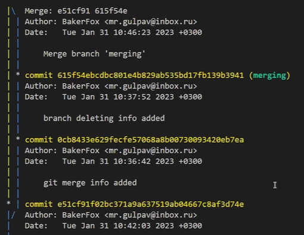
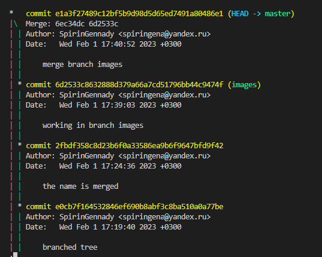

# Второй семинар. Работа с ветками

## Branch creating

* *git branch `branch_name`* - команда, инициализирующая новую ветку `branch_name`;

* *git checkout `branch_name`* - команда, перехода в ветку `branch_name`;

## Branch information

* *git log --graph* - команда, позволяющая увидеть общее дерево коммитов со всеми ветвями.

* *git config --global user.email "`new_email`"* - команда замены текущего email на новый `new_email`

## Branch merging

* *git merge `branch_name`* - команда, сливающая текущую ветку с `branch_name`
* *git branch -d `branch_name`* - команда удаления ветки `branch_name`;

## Branch images

`Должно получится ветвистое дерево`:

`У меня тоже получилось!`

